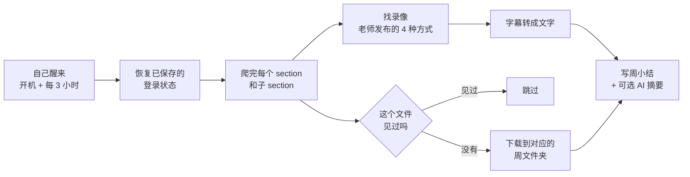
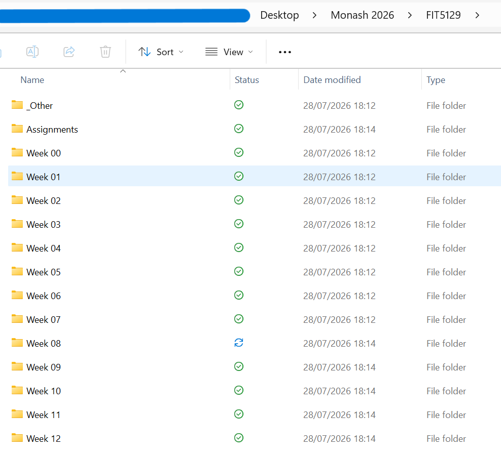
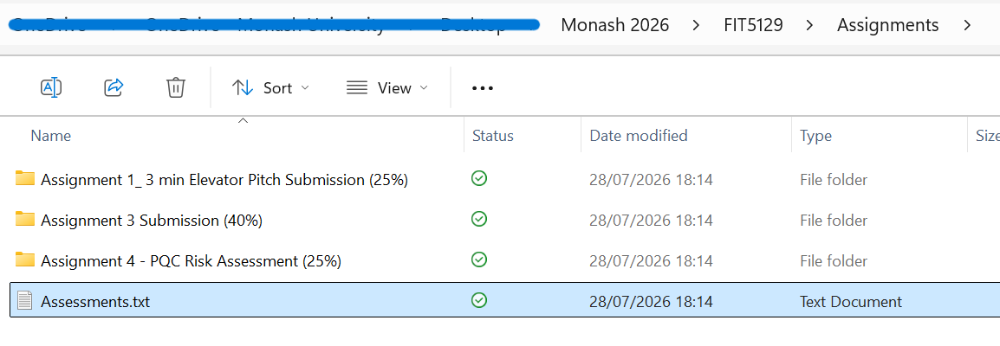

# Moodle Downloader

[English](README.md) | **简体中文**


**把这学期每门课的资料，自动归进周文件夹，一整个学期不用你管。**
课程录像会被转成可读的文字稿，所以一周的内容是你能搜索、能速读、能直接丢给
AI 的文本。

> **为 Monash 学生而写。** 它是照着 Monash 的 Moodle、Panopto 和统一登录写的。
> 其他学校不在支持范围内——它认识的课程结构是 Monash 自定义的那一套。


---

## 它到底替你做什么

你点一次，之后这些事情自己发生：

| | 你会得到 | 需要配置吗 |
| :-- | :-- | :-- |
| 📂 **课件** | 每份讲义、习题、阅读材料和答案，归进 `Week 00` – `Week 12` | 不需要 |
| 🕐 **补发的文件** | 课后三天才放出来的 tutorial 答案，自己就来了 | 不需要 |
| 📝 **作业** | 每个作业的说明和评分标准各一个文件夹，外加一份含截止日期的考核索引 | 不需要 |
| 🎧 **录像文字稿** | 课程录像转成可读文字——不下载视频本身 | 不需要 |
| 🗒️ **每周小结** | 一份 `Week NN Summary`，列出本周文件、录像，以及接下来要交什么 | 不需要 |
| 🤖 **AI 摘要** | 每份文字稿上方多一段可直接拿来复习的摘要 | 一个 API key（[见下](#ai-摘要可选)） |
| 🔒 **你的密码** | 程序永远看不到。登录发生在 Monash 自己的页面上 | 不需要 |

**同一个文件永远不会下载两次。** 误删了，下次同步它会自己回来。程序换个位置放，
设置也跟着走。

---

## 一次同步做了什么



全程没有窗口，也没有弹窗。只有当你的 Monash 登录真的过期了，你才会看见它。

---

## 怎么开始 —— Windows，不用装任何东西

1. **下载** [Releases](../../releases) 里的 `MoodleDownloader.exe`，放哪都行。
   Windows 会提示「未知发布者」——免费的未签名软件都会这样，选
   **更多信息 → 仍要运行**。
2. **打开它**，选好文件存哪，点 **Load my courses from Moodle**。
   浏览器窗口弹出来时登录，记得勾 **"Keep me signed in"**，之后就很少再需要登录。
3. **勾上你的课** → **Finish and run first sync**。
4. **Auto-sync 保持开着。** 就这样，新文件会自己来。


> 你的密码只会输进 Monash 自己的登录页。没有服务器、没有账号、没有任何数据回传。
> 登录 cookie 只留在你自己电脑的 `%LOCALAPPDATA%\moodle-downloader` 里。

---

## 最后长这样

```
你的文件夹/
├── FIT5129/
│   ├── Week 00 … Week 12/
│   │   ├── 讲义、习题、答案 …
│   │   ├── Week 02 Summary.docx      ← 这周发生了什么
│   │   └── Transcripts/              ← 课程录像的文字稿
│   ├── Assignments/                  ← 作业说明、评分标准 + 考核索引
│   └── _Other/                       ← 没匹配上任何一周的东西
└── FIT5136/
    └── …
```

| | |
| :-- | :-- |
|  |  |
| 每门课都有 `Week 00`–`Week 12`、`Assignments` 和 `_Other`，并一直保持最新。 | 每个作业一个文件夹——只抓老师上传的附件，绝不碰你自己的提交。 |

---

## AI 摘要（可选）

**上面所有功能都不需要 API key，也不会把任何东西发出去。** 不填，这个功能根本不出现。

### 配一个 key 能多得到什么

1. **每份文字稿上方多一段摘要**——写得够细，是能直接拿来复习的程度，不是提要。
   讲到的每个主题都有自己的小节。
2. **YouTube 把你挡了的时候有退路。** YouTube 是按 IP 限流的。被挡住时，
   可以让 Gemini 从 Google 那一侧直接读这个视频——文字稿照样能拿到。

### 该选哪个

| 如果你… | 选 | 为什么 |
| :-- | :-- | :-- |
| 只想免费用 | **Gemini** | Google 的免费额度是几家里最宽松的，也是本工具的默认 |
| 不希望任何东西离开电脑 | **Ollama** | 本地跑。不用 key、不花钱、数据不出本机 |
| 已经在付 ChatGPT / Claude 的 API | **OpenAI** / **Anthropic** | 不用再开新账号 |
| 在中国大陆网络环境 | **DeepSeek**、**GLM**、**Qwen**、**Kimi** | 不用梯子就能连，而且便宜 |

在设置界面选好服务商、把 key 贴进去就行，没有别的要配。

### 到底要花多少钱

把账摊开算给你看，你自己判断：

| | 一个典型学期 |
| :-- | :-- |
| 课程数 | 4 门 |
| 转录的录像 | 约 100 个 |
| API 调用次数 | 约 100 次（每个录像一次） |
| 输入 token | 约 1,000,000（一节课的文字稿约 9k token） |
| 输出 token | 约 200,000 |

按 Gemini 2.5 Flash-Lite 官方公布的 **每百万输入 $0.10、每百万输出 $0.40** 计算，
整个学期大约 **$0.20**——走免费额度的话则是完全不花钱。工具本身强制每次调用间隔
6 秒，一学期约 100 次请求，离免费额度的上限还很远。

> 价格会变，模型也会下线。真要开付费档之前，请以官方页面为准：
> [Gemini](https://ai.google.dev/gemini-api/docs/pricing) ·
> [OpenAI](https://openai.com/api/pricing/) ·
> [Anthropic](https://www.anthropic.com/pricing) ·
> [DeepSeek](https://api-docs.deepseek.com/quick_start/pricing) ·
> [Moonshot / Kimi](https://platform.moonshot.cn/docs/pricing) ·
> [智谱 GLM](https://open.bigmodel.cn/pricing) ·
> [通义千问](https://help.aliyun.com/zh/model-studio/billing-for-model-studio)

你的 key 存在你自己的配置文件里，只会发给它所属的那家服务商。

---

## 做不到的时候，它会告诉你为什么

悄悄跳过是 bug 能一直藏着的原因，所以每个没能转成文字的录像，都会在周小结里
被点名，**并写清楚原因**——而且原因会告诉你，这事值不值得等：

| 你会看到 | 意思 | 会重试吗 |
| :-- | :-- | :-- |
| has no captions | 真的没有字幕——比如 Zoom 云录像 | 不会，这是最终结论 |
| the platform is rate-limiting us | YouTube 暂时把我们的地址挡了 | 会，下次同步 |
| could not be reached | 网络或平台抽风 | 会，下次同步 |
| needs you to sign in to the video platform | Panopto 还要再登录一次 | 会，下次同步 |
| queued for the next sync | 故意压着的，为了不超 YouTube 的限流 | 会，下次同步 |

---

## 你可以改什么

课程、下载目录、同步间隔和 AI 服务商，都在程序窗口里改。其余的都在同一个
`config.yaml` 里，按用户存在 `%LOCALAPPDATA%\moodle-downloader\`——所以换掉或
移动程序，设置都不会丢。

| 设置项 | 作用 | 默认 |
| :-- | :-- | :-- |
| `root_dir` | 课程文件存在哪 | `./MoodleFiles` |
| `course_selection` | `manual`（固定列表）或 `starred`（跟随 Moodle 收藏） | `manual` |
| `sync_interval_hours` | 自动同步的间隔 | `3` |
| `section_patterns` | 把 section 标题匹配到周的正则——如果你的课写「Module 3」，加一条 `"module\s*0*{week}\b"` | Week / Topic |
| `assignments_folder` | 设成 `""` 就完全跳过作业 | `Assignments` |
| `weekly_notes` | `false` 关掉每周小结 | `true` |
| `transcripts` | `false` 关掉字幕下载 | `true` |
| `note_formats` | 输出格式——`docx`、`txt`、`md` | `docx`、`txt` |
| `max_youtube_per_sync` | YouTube 字幕抓取上限，**按每次同步计，所有课合计** | `8` |
| `ai_provider` / `ai_api_key` | 可选的 AI 摘要 | 关闭 |

> **为什么是 Word 而不是 Markdown？** 大多数人从没打开过 `.md` 文件，而所有
> AI 对话工具都收 `.docx` 和 `.txt`。Markdown 可以开，但默认关着。

---

## 常见问题

**弹出浏览器窗口让我登录。**
保存的登录过期了。在那个窗口里登录，同步会自己继续。别关窗口。

**我的课写的是「Module 3」不是「Week 3」。**
在 `config.yaml` 的 `section_patterns` 里加一条规则。

**文件跑进 `_Other/` 了。**
那个 section 的标题没匹配上任何一周——解决办法同上。

**我把 exe 挪了位置，自动同步就不动了。**
把 Auto-sync 关掉再打开，重新登记新位置。

**这样做合规吗？**
它下载的是你已选课程里的材料，走你自己的登录，供你自己学习——和你一个个点开
下载拿到的是同一批文件。

---

## 开发者 · macOS · Linux

需要 Python 3.10+。

```bash
pip install -r requirements.txt
python run.py            # 图形界面
python run.py sync       # 无界面同步，可挂 cron 或计划任务
```

它通过 Playwright 驱动一个真实浏览器，优先用系统自带的 Edge 或 Chrome；
都没有的话执行一次 `playwright install chromium`。macOS 和 Linux 理论上能跑，
但没有定期测试。

编译 Windows 可执行文件：

```bash
pyinstaller MoodleDownloader.spec --noconfirm
```

`docs/maintainer-notes.md` 记录了爬虫、字幕管线和 AI 处理背后的那些发现——
改这几块之前先读它。

---

## 许可证

MIT
