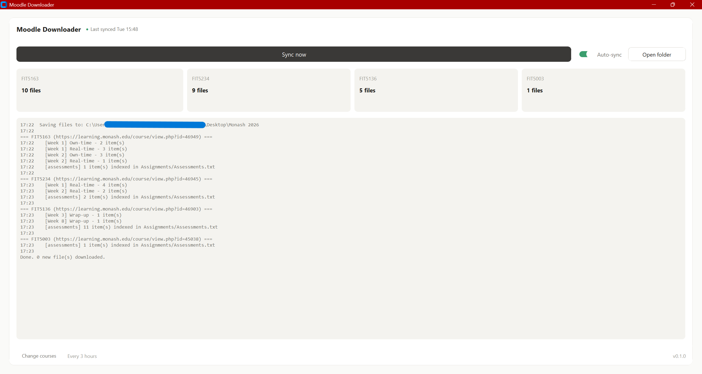
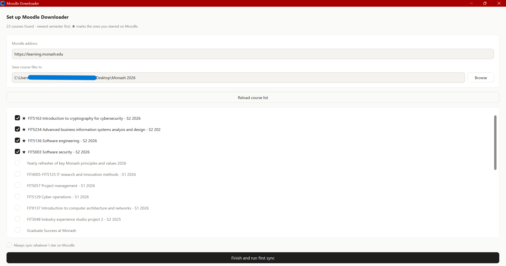

# Moodle Downloader(Moodle 课件自动下载器)

[English](README.md) | 简体中文

**面向 Monash 大学学生**。本工具是针对 Monash 的 Moodle、Panopto 和统一
登录开发的,其他学校不在支持范围内。

自动把 Moodle 上发布的每一份讲义、习题和作业要求归入周文件夹,
整个学期自行运行。讲座录播会被转成可读的文字稿,让一周的材料变成可搜索、
可快速浏览、也可以直接丢给 AI 的文本。晚发布的答案会在下一次同步时自动
补上,任何文件都不会重复下载。

```
你的文件夹/
├── FIT5003/
│   ├── Week 00 ... Week 12/
│   │   ├── 讲义、习题、答案 ...
│   │   ├── Week 02 Summary.md      <- 本周发生了什么
│   │   └── Transcripts/            <- 录播转成的文字稿
│   ├── Assignments/                <- 作业题目、评分标准 + 考核清单
│   └── _Other/                     <- 不属于任何周的文件
└── FIT5136/
    └── ...
```



## 快速上手(Windows,无需安装)

1. 从 [Releases](../../releases) 下载 `MoodleDownloader.exe`,放到任意
   文件夹。Windows 可能提示"未知发布者"——免费软件没有付费签名证书时都会
   这样,点 **更多信息 → 仍要运行** 即可。
2. 双击打开。选好课件保存位置,点 **Load my courses from Moodle**,在弹出的
   浏览器里登录,**记得勾选 "Keep me signed in / 保持登录"**,这样以后极少
   再需要登录。
3. 勾选你的课程,点 **Finish and run first sync**。
4. 保持 **Auto-sync** 开关打开,之后新文件会自己静默到达。



你的密码只会输入在学校官方登录页面,本工具看不到,也不会向任何地方发送数据
——没有服务器,也不需要注册账号。登录 cookie 保存在本机
`%LOCALAPPDATA%\moodle-downloader`。

## 工作原理

- **登录**:由真实浏览器窗口完成 SSO 与 MFA,登录状态被保存并在后续运行时
  自动恢复,因此同步全程静默,直到会话真正过期。
- **抓取**:遍历课程的每个 section,包括嵌套的子 section(Monash 把
  `Week N` 嵌在 `Learning` 里,每周内还有 `Own-time` / `Real-time` 等板块),
  子 section 自动归入所属的周。
- **增量同步**:下载目录里的 `.manifest.json` 记录已获取的文件。重复运行
  只下载新增内容;本地删掉的文件下次会自动补回;老师替换过的文件会保存在
  旧版本旁边而不是覆盖。
- **自动同步**:登录 Windows 时运行一次,之后每隔几小时再跑一次,全程无窗口。
- **作业**:老师上传的题目和评分标准(绝不包含你自己提交的文件)保存到
  `UNIT/Assignments/作业名/`,同时生成 `Assessments.txt`,列出全部考核项、
  截止时间和链接。
- **每周汇总笔记**:每个周文件夹自动生成 `Week NN Summary.md`(以及 Word
  版本),列出本周的文件、录播和外部链接、以及接下来要交的作业和截止时间。
  每次同步都会重写这个文件,所以你自己的笔记请写在别的文件里。
- **讲座文字稿**:**不下载任何视频**,只取字幕。Panopto(需额外单点登录
  一次)和 YouTube 的录播会转成可读文稿,存在 `Week NN/Transcripts/`。
  三种发布形式都能识别:超链接、直接打在页面里的纯文本网址、以及嵌在
  Page 活动里的视频。没有字幕的录播(包括 Zoom 云录制)会在每周笔记里
  单独列出,让你知道有这么个视频需要自己看。
- **AI 总结(可选)**:在 `config.yaml` 里填入 API key 后,每份文稿会额外
  生成一段要点总结。支持 Gemini(有免费额度)、Claude、OpenAI、DeepSeek、
  Kimi、智谱 GLM、通义千问,以及本地 Ollama;不填 key 就不会出现这部分。

## 设置项

一般无需修改。程序旁的 `config.yaml` 提供:

| 配置项 | 含义 |
| --- | --- |
| `root_dir` | 课件保存位置 |
| `course_selection` | `manual`(固定课程列表)或 `starred`(跟随 Moodle 星标) |
| `sync_interval_hours` | 自动同步间隔,默认 `3` 小时 |
| `section_patterns` | 匹配周数的正则,例如可加 `"module\\s*0*{week}\\b"` |
| `assignments_folder` | 设为 `""` 可完全跳过作业抓取 |

## 开发者 / macOS / Linux

需要 Python 3.10+。

```bash
pip install -r requirements.txt
python run.py            # 图形界面
python run.py sync       # 无界面同步,可供计划任务或 cron 调用
```

本工具通过 Playwright 驱动真实浏览器,优先使用系统自带的 Edge 或 Chrome;
若都没有,运行一次 `playwright install chromium` 即可。macOS 与 Linux
理论可用,但未经常态化测试。

打包 Windows 可执行文件:

```bash
pyinstaller --onefile --noconsole --name MoodleDownloader ^
  --version-file version_info.txt ^
  --collect-all playwright --collect-all customtkinter run.py
```

## 常见问题

**弹出浏览器要我登录。** 说明保存的登录状态过期了,在那个窗口里登录即可,
同步会自动继续。不要手动关闭窗口。

**我的课用的是 "Module 3" 而不是 "Week 3"。** 在 `config.yaml` 的
`section_patterns` 里加一条对应的正则。

**文件跑到 `_Other/` 里了。** 说明那个 section 标题没匹配到任何周数,
解决方法同上。

**我移动了 exe,自动同步失效了。** 把 Auto-sync 关掉再打开,即可重新登记
新位置。

**这样做合规吗?** 本工具通过你本人的登录,下载你已注册课程的资料供个人
学习使用——和你自己一个一个点下载得到的文件完全相同。

## 许可证

MIT
